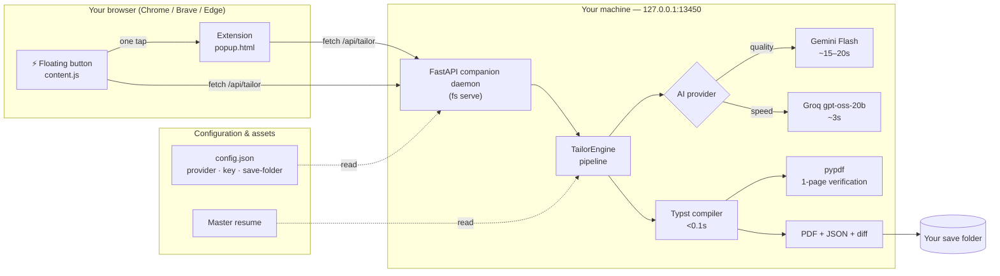

<div align="center">

# ⚡ Flash Resume

**The job-post-to-1-page-PDF pipeline in one tap.** ATS-targeted resume tailoring, layout-verified single-page PDFs, from your terminal or straight from the job page.

[](https://pypi.org/project/flash-resume/)
[](https://www.python.org/)
[](#quick-start)
[](https://github.com/PavanBollepalli/flash-resume)

**Precision of a human rewrite. Speed of a keystroke. Zero hallucinated experience.**

</div>

---

## 🚪 Why Flash Resume

Applying to jobs today means juggling **three tabs** — job board, ChatGPT, and a LaTeX/Overleaf editor — then praying the result still fits on **one page**. Full-document AI rewrites take 15+ seconds, **invent experience you never had**, and silently spill your resume onto page 2 (an instant auto-reject for most ATS).

**Flash Resume kills that loop.** It surgically injects the job's keywords into bullets you already have, compiles locally at sub-100ms, and *verifies* the single-page fit before you upload. What used to take a coffee break now takes **one tap**.

> [!TIP]
> Set it up once (2 minutes). Every application after that is a single tap on a floating button.

---

## ✨ What it does

| | |
|---|---|
| 🎯 **Targeted ATS diffing** | Injects high-density keywords from the job description directly into your existing skills and bullets — under a strict **±2-word budget** so nothing overflows. |
| ⚡ **Near-instant or top-quality** | Pick **Groq** for a ~3s tailor, or **Gemini** for the absolute best ATS keyword quality (~5-9s). Switch anytime. |
| 📄 **Verified 1-page PDF** | Local **Typst** compilation in <100ms, then `pypdf` inspects the output to guarantee a **true single-page fit** — no page-2 surprises. |
| 🧩 **1-click browser extension** | A blue ⚡ button floats on LinkedIn, Indeed, and Greenhouse. One tap → PDF saved to your folder. No download dialog, no copy-paste. |
| 🔒 **100% truthful** | The engine only rephrases experience you actually have. It never fabricates companies, degrees, metrics, or domains. |

---

## 🧭 How it works

```
┌─────────────┐   mirror keyword   ┌──────────────┐   compile    ┌──────────────────┐   verify    ┌───────────────┐
│ Job post    │ ───────────────▶  │  Your master │ ──────────▶   │   Typst engine   │ ─────────▶  │ 1-page PDF +  │
│  (JD text)  │   diff against    │    resume    │  (<0.1s)      │  (bundled, local) │  (pypdf)    │   review diff  │
└─────────────┘                   └──────────────┘               └──────────────────┘              └───────────────┘
        ▲                                                                                                  ▲
        │                                                          AI keyword plan (Gemini / Groq)          │
        │                                                                                                  │
   clipboard / one-tap FAB / pasted text                                                            saved to your folder
```

**The flow:**

1. **You get the JD** — copy it to your clipboard, or just tap the ⚡ button on a job page.
2. **Flash Resume reads it** — auto-infers the target **company** and **role**.
3. **The AI maps keywords** — matches JD terms against your master resume, the LLM (Gemini or Groq) selects high-impact ATS keywords that fit your real experience.
4. **It rewrites with discipline** — surgically edits only relevant bullets/skills, keeping every rewrite within ±2 words and 100% truthful.
5. **It compiles & verifies** — builds the PDF locally in <100ms and checks the output is exactly **one page**.
6. **You get everything** — `Company_Role.pdf`, a structured `.json`, and a `.diff.md` review report, plus a rich terminal diff showing exactly what changed.

---

## 🏗️ Architecture

**High level** — the extension is a thin client; all intelligence and configuration live in the local engine:



**Key design decision:** your API key and master resume live **only** on the local server. The extension never sees them — it just POSTs the job description to `127.0.0.1:13450`. Nothing leaves your machine except the JD you choose to send to your AI provider.

**Project layout:**

```
flash-resume/
├── pyproject.toml               # Dependencies & fs scripts
├── templates/
│   └── resume.typ               # Modern, ATS-optimized Typst template
├── extension/                   # Manifest V3 Chrome extension
│   ├── manifest.json
│   ├── popup.html / js          # Tailor UI + saved-path view
│   ├── content.js               # Job extractor + one-tap ⚡ floating button
│   └── icons/                   # "fr" toolbar icons (16/48/128)
├── src/flash_resume/
│   ├── cli.py                   # fs CLI (setup, init, tailor, serve, …)
│   ├── config.py                # ~/.config/flash-resume/config.json
│   ├── bootstrap.py             # Silent server entrypoint (pythonw -m …)
│   ├── autostart.py             # Windows Run-key at-login registration
│   ├── extension.py             # Bundled extension installer
│   ├── models/                  # resume.py · job.py · tailoring.py
│   ├── services/
│   │   ├── compiler.py          # Typst + pypdf page validation
│   │   ├── llm.py               # Gemini Flash provider
│   │   ├── groq_llm.py          # Groq gpt-oss-20b fast provider
│   │   ├── tailor.py            # Pipeline orchestrator & diff generator
│   │   └── server.py            # FastAPI companion daemon
│   └── utils/diff.py            # Rich terminal visualization
├── examples/                    # Sample master resume + JD
└── tests/                       # test_models · test_compiler · test_tailor
```

---

## 🚀 Quick Start (Windows)

### 1 · Install

```powershell
pip install flash-resume
```

That's it — the package bundles **everything** (Typst engine, AI clients, extension files). No extra dependencies.

### 2 · One-time setup

```powershell
fs setup
```

A short interactive wizard that walks you through:

1. **AI provider** — Gemini (quality) or Groq (speed), plus your free API key
2. **Save folder** — where tailored PDFs land
3. **Master resume** — loads your real resume (runs the `fs init` wizard if you haven't yet)
4. **Autostart** — registers the engine to start silently at login, no terminal ever needed again
5. **Extension** — copies the extension to a stable folder and prints where to load it

### 3 · Load the extension (once)

1. Open `chrome://extensions/` (works in **Chrome, Brave, Edge**)
2. Enable **Developer mode** (top-right toggle)
3. Click **Load unpacked** and select the folder `fs setup` printed (default: `%LOCALAPPDATA%\flash-resume\extension`)

> [!NOTE]
> When you use the floating ⚡ button, Chrome asks you to allow access to `localhost:13450` **once** — that's how the page-side button reaches the local engine. Grant it and you're done forever.

**That's it.** The engine autostarts at login and the extension reconnects automatically — no reloads, no terminal, no "keep this window open."

---

## 🧑‍💻 Daily usage

### The one-tap way (fastest)

Open any job on **LinkedIn**, **Indeed**, or **Greenhouse** and **tap the ⚡ floating button** in the bottom-right corner. Flash Resume auto-detects the job, tailors, and shows a toast with your ATS score and saved path.

### The detailed way (review / retry)

Open the popup and hit **"⚡ Tailor 1-Page Resume"** — company, role, and JD are auto-filled (including anything you've text-selected on the page).

### The terminal way (everywhere else)

Copy the job description (`Ctrl+C`), then:

```powershell
fs tailor
```

Flash Resume reads the clipboard, infers the company/role, tailors, and drops three files in your save folder:

| File | What it is |
|------|------------|
| `Company_Role.pdf` | ✅ Ready to upload |
| `Company_Role.json` | Structured tailored resume |
| `Company_Role.diff.md` | Reviewable before/after report |

…plus a rich terminal diff:

```text
✓ Flash Resume Tailoring Complete
Datadog — Backend Software Engineer
ATS Match Score: 94%  |  Pages: 1 page (Layout Verified)  |  Compile: 72.5ms  |  Total: 1.84s

Integrated ATS Keywords:  FastAPI    PostgreSQL    Docker    Redis
```

### Handy overrides

```powershell
# Tailor from a file or string instead of the clipboard
fs tailor --jd ./jobs/datadog_swe.txt

# Paste a long JD safely (quotes & apostrophes included)
Get-Content ./jobs/joveo.txt | fs tailor --jd -
cat ./jobs/joveo.txt | fs tailor --jd -          # Git Bash

# Override company / role
fs tailor --company "Google" --role "Site Reliability Engineer"

# Custom output folder
fs tailor --out ./applications/2026/
```

---

## 🛠️ CLI reference

| Command | What it does |
|---------|--------------|
| `fs setup` | Interactive one-time configuration (provider, key, save folder, resume, autostart, extension) |
| `fs init` | Create/edit your master resume |
| `fs import` | Bring in an existing resume |
| `fs tailor` | Read JD → tailor → verified 1-page PDF (clipboard by default) |
| `fs serve` | Run the local engine on `127.0.0.1:13450` (the extension needs it) |
| `fs doctor` | Check that everything is healthy |
| `fs autostart status` | Is the at-login autostart registered? |
| `fs autostart enable` / `disable` | Turn the at-login engine on / off |
| `fs extension-path` | Print the folder to load in `chrome://extensions` |
| `fs --version` | Show version |

---

## 🛡️ Product principles

* **100% factual** — the engine only maps keywords and rephrases bullets that match your real experience. It never invents companies, degrees, metrics, or domains.
* **Layout-preserving budgets** — every replacement bullet is constrained to ±2 words of the original, so the layout can't blow up.
* **Sub-100ms local compilation** — pure local Typst, no external render queues.
* **Local-first & private** — your key and resume never leave your machine except for the JD you choose to send your AI provider.

---

## 🧪 Development

```powershell
git clone https://github.com/PavanBollepalli/flash-resume.git
cd flash-resume
uv sync
uv run fs init
uv run fs doctor
uv run pytest
```

---

## 🙌 Contributing

Found a bug, want a new job-board parser, or a macOS/Linux heartbeat? Open an issue or a PR. Contributions of the "it still fits on one page" energy are especially welcome. ⚡

---

<div align="center">

**Made for people who'd rather be applying than reformatting.** ⭐ Star it, fork it, take a job with it.

</div>
