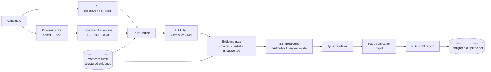

<div align="center">

# ⚡ Flash Resume

### Evidence-led resume tailoring for applications that deserve more than a keyword dump.

**2-minute setup. One focused workflow per application. More time applying, less time formatting.**

Turn any job description into a **truthful, ATS-targeted, verified one-page PDF** — from your browser or terminal.

[](https://pypi.org/project/flash-resume/)
[](https://www.python.org/)
[](#installation)
[](#development)

**Precision of a human rewrite. Speed of a keystroke. Zero hallucinated experience.**

</div>

---

## Why Flash Resume

Every serious application today is the same **3-tab shuffle**: job board → ChatGPT → LaTeX/Overleaf. Rewriting bullets by hand, pasting them back, compiling, and praying it still fits on **one page**. When it doesn't, you trim, recompile, pray again — and a recruiter would have auto-rejected the 2-page version anyway.

That loop costs **15–30 minutes per application** — and full-document AI rewrites make it worse: they take 10+ seconds, hallucinate experience you don't have, and blow up your layout.

**Flash Resume kills the loop.**

Instead of replacing your resume with a generic AI rewrite, Flash Resume:

- starts from your real master resume;
- maps the JD to evidence you actually have;
- makes small, reviewable role-specific edits; and
- compiles and verifies the final one-page PDF before saving it.

The result is a faster workflow without sacrificing credibility:

> **Use AI to identify relevance. Use structured evidence to decide what can be claimed. Use a local compiler to prove the result fits.**

| | Manual workflow | Flash Resume |
|---|---|---|
| Time per application | 15–30 minutes | **One focused workflow** |
| Keyword targeting | You guess what to add | **JD mapped to your real evidence** |
| Unsupported claims | Easy to introduce | **Blocked from normal tailoring** |
| Layout risk | Discover page overflow after editing | **Compiled and page-checked before saving** |
| Reviewability | Scattered edits across multiple tools | **PDF + readable diff report** |
| Workflow | Job board → AI chat → document editor | **Select JD → click → review output** |

## Why it is different

| Concern | Flash Resume's approach |
|---|---|
| Speed | A local pipeline handles parsing, planning, compilation, and output generation. |
| Accuracy | Tailoring is constrained by evidence extracted from your master resume. |
| ATS relevance | Job requirements are normalized, split into alternatives/compound groups, and matched against resume evidence. |
| Honesty | Unsupported claims stay unsupported in Truthful mode. |
| Interview preparation | Interview mode can add closely related skills to a separate, clearly labeled **Familiarity** section. |
| Layout | Typst compiles the resume and `pypdf` verifies the page count before the result is saved. |
| Reviewability | Every application produces a PDF and a readable before/after diff. |
| Privacy | The engine, master resume, API key, and generated files stay local. Only the job description you submit is sent to your selected AI provider. |

---

## What it does

| | |
|---|---|
| 🎯 **Evidence-based ATS matching** | Maps job requirements to structured evidence from your master resume instead of treating every keyword as a qualification. |
| ✍️ **Surgical tailoring** | Improves relevant skills and bullets without replacing your career history with a generic AI rewrite. |
| 📄 **Verified one-page output** | Compiles with Typst and checks the generated PDF before it is saved. |
| 🧩 **Selection-first browser workflow** | Select the JD text, click the blue or red Flash Resume button on the right edge, and let the local engine handle the rest. |
| 📥 **Resume import** | Imports existing PDF, text, Markdown, or JSON resumes and recovers useful structured information such as links and certifications. |
| 🔒 **Local-first design** | Your master resume and API key stay in the local engine; the extension is only a thin client. |
| 🪄 **Overflow recovery** | Uses density fallback and targeted trimming to preserve a one-page result while protecting the strongest content. |

---

## What you get

For each tailored application, Flash Resume can produce:

```text
Company_Role.pdf       # upload-ready resume
Company_Role.diff.md   # reviewable changes and evidence report
```

The report includes:

- target company and role;
- evidence-based ATS coverage score;
- covered, partial, and unsupported requirements;
- the evidence used for each matched requirement;
- applied bullet and skill changes;
- familiarity skills, when Interview mode is enabled;
- page count and compilation timings.

The score is intentionally not a promise that an external ATS will accept an application. It is a transparent measure of how much of the extracted requirement set is supported by the resume you provided.

---

## Two modes, one standard of clarity

### Truthful mode — blue

The default mode. It can:

- preserve supported skills and experience;
- highlight relevant evidence;
- tailor wording around real projects, roles, certifications, and education;
- add supported keywords where the master resume provides evidence.

It does **not** invent a framework, employer, degree, certification, metric, or production experience.

### Interview mode — red

Interview mode is for a candidate who has a strong adjacent foundation and wants to signal professional familiarity with a closely related requirement.

For example:

```text
Existing evidence: Python
JD requirement:    FastAPI
Possible output:   FastAPI (familiarity)
```

These additions are kept separate from normal experience and skills. They are not presented as production experience, and they are not silently merged into existing bullets.

Use this mode only for skills you are prepared to discuss honestly and learn enough to explain in an interview.

---

## How the pipeline works

```text
                    selected job description
                              │
                              ▼
┌─────────────┐      ┌─────────────────┐      ┌──────────────────┐
│ Browser or  │ ───▶ │ LLM plan        │ ───▶ │ Evidence matcher │
│ CLI input   │      │ JD + edit plan  │      │ supported?       │
└─────────────┘      └─────────────────┘      └────────┬─────────┘
                                                       │
                                                       ▼
                                            ┌────────────────────┐
                                            │ Surgical tailoring │
                                            │ + familiarity gate │
                                            └─────────┬──────────┘
                                                      │
                                                      ▼
                                            ┌────────────────────┐
                                            │ Typst compile      │
                                            │ pypdf page check   │
                                            └─────────┬──────────┘
                                                      │
                                                      ▼
                                           PDF + diff report
```

1. You provide a job description.
2. Flash Resume extracts the role, company, and ATS-relevant requirements.
3. Gemini or Groq generates a structured tailoring plan.
4. The deterministic evidence layer checks the plan against the master resume.
5. Unsupported claims are removed from the normal resume path.
6. Relevant edits and allowed familiarity items are applied.
7. Typst compiles the document.
8. The output is checked for page count and saved with a report.

### Evidence matching is more than exact keyword search

The matcher understands patterns such as:

- alternatives: `Java/TypeScript/Python`;
- comma-separated alternatives: `AWS, GCP, Azure`;
- natural-language alternatives: `data pipelines or APIs`;
- compound requirements: `supervised, unsupervised, and reinforcement learning`;
- structured education: `B.Tech in Computer Science` versus `Bachelor's degree`;
- related evidence rules for APIs, software design, algorithms, cloud platforms, analytics, and other common requirements;
- partial credit when only part of a compound requirement is supported.

It also filters job-title/context phrases so `Software Engineer (AI)` is not incorrectly treated as a technical skill requirement.

---

## Installation

### Requirements

- Windows for the background autostart integration;
- Python 3.12 or newer;
- a Gemini or Groq API key;
- Chrome, Brave, or Edge for the browser extension.

### Install from PyPI

```powershell
py -m pip install flash-resume
```

### Run the setup wizard

```powershell
fs setup
```

The wizard configures:

1. AI provider and API key;
2. output directory;
3. master resume import or creation;
4. Windows login autostart;
5. the bundled browser extension.

`fs setup` registers the background engine and attempts to start it immediately. You do not need to leave a terminal open.

### Load the extension once

1. Run:

   ```powershell
   fs extension-path
   ```

2. Open `chrome://extensions/`.
3. Turn on **Developer mode**.
4. Choose **Load unpacked**.
5. Select the folder printed by `fs extension-path`.

After source or package updates, reload the extension from the Extensions page.

---

## Daily workflow

### Fast browser workflow

1. Open a job page in Chrome, Brave, or Edge.
2. Drag across the job description you want to use.
3. Click the **Flash Resume button on the right edge of the page**.
4. Flash Resume sends only the selected job description to the local engine.
5. The engine tailors the resume and saves the PDF and reports to your configured folder.

The button is:

- **blue** in Truthful mode;
- **red** in Interview mode.

Open the extension popup to switch modes. The color change is synchronized between the popup and the page button.

The extension reads the page heading only when available to improve company and role naming. It does not send the whole page as the job description.

### Terminal workflow

Use the clipboard:

```powershell
fs tailor
```

Use a file:

```powershell
fs tailor --jd .\jobs\backend-role.txt
```

Read from standard input:

```powershell
Get-Content .\jobs\backend-role.txt | fs tailor --jd -
```

Override inferred metadata:

```powershell
fs tailor `
  --jd .\jobs\backend-role.txt `
  --company "Example Labs" `
  --role "Backend Software Engineer"
```

Override the output directory:

```powershell
fs tailor --jd .\jobs\backend-role.txt --out .\applications\example-labs
```

Typical completion output:

```text
✓ Flash Resume Tailoring Complete
Example Labs — Backend Software Engineer
ATS Match Score: 88%  |  Pages: 1 page (Layout Verified)
Compile: 72.5ms  |  Total: 1.84s

Integrated ATS Keywords:  FastAPI    PostgreSQL    Docker    REST APIs
```

---

## CLI reference

| Command | Purpose |
|---|---|
| `fs setup` | Configure provider, keys, output folder, master resume, autostart, and extension |
| `fs init` | Create or edit a master resume |
| `fs import` | Import an existing resume file and recover structured data |
| `fs tailor` | Tailor a job description into a verified output set |
| `fs serve` | Run the local FastAPI companion engine |
| `fs doctor` | Check configuration, resume, provider, Typst, and output directory health |
| `fs autostart status` | Show Windows login-start registration |
| `fs autostart enable` | Register and start the background engine |
| `fs autostart disable` | Remove the Windows login-start registration |
| `fs extension-path` | Print and install the browser extension folder |
| `fs --version` | Print the installed package version |

### Health checks

```powershell
fs doctor
fs autostart status
curl http://127.0.0.1:13450/api/status
```

The local status endpoint reports whether the engine is online, whether a master resume is configured, the active provider, and whether the relevant key is available.

---

## Importing an existing resume

You can start with an existing PDF instead of building a resume from zero:

```powershell
fs import .\resume.pdf
```

The import pipeline can:

- extract visible PDF text;
- recover hyperlinks hidden behind labels such as `GitHub` or `LinkedIn`;
- clean common PDF extraction artifacts;
- normalize the result into the structured master-resume model;
- preserve education, experience, projects, certifications, and skills for later tailoring.

Review the imported master resume before relying on it for applications. The quality of the evidence report is bounded by the quality of the source resume.

---

## Privacy and security model

Flash Resume is local-first:

```text
Browser extension ──local HTTP──▶ 127.0.0.1:13450
                                      │
                                      ├── master resume
                                      ├── API key
                                      ├── tailoring pipeline
                                      └── generated files
```

- The extension does not contain your API key.
- The extension does not store your master resume.
- The local engine owns configuration and generated files.
- The selected job description is sent to the AI provider you configure.
- No hosted Flash Resume account is required for the local workflow.

Treat generated resumes and job descriptions as sensitive application data. Use API keys with the provider whose data-handling policy matches your requirements.

---

## Architecture

Flash Resume is a thin browser/CLI client wrapped around a local, evidence-aware resume engine.


```mermaid
flowchart LR
    USER["Candidate"] --> BROWSER["Browser button<br/>select JD text"]
    USER --> CLI["CLI<br/>clipboard / file / stdin"]

    BROWSER --> API["Local FastAPI engine<br/>127.0.0.1:13450"]
    CLI --> PIPELINE["TailorEngine"]
    API --> PIPELINE

    RESUME[("Master resume<br/>structured evidence")] --> PIPELINE
    PIPELINE --> PLAN["LLM plan<br/>Gemini or Groq"]
    PLAN --> GATE["Evidence gate<br/>covered · partial · unsupported"]
    RESUME --> GATE
    GATE --> EDITS["Sanitized edits<br/>Truthful or Interview mode"]
    EDITS --> RENDER["Typst renderer"]
    RENDER --> VERIFY["Page verification<br/>pypdf"]
    VERIFY --> OUTPUT["PDF + diff report"]
    OUTPUT --> FOLDER[("Configured output folder")]
```

### The important boundary

The language model proposes relevance. It does not get the final say on what the resume can claim.

```text
LLM proposal
     │
     ▼
Structured evidence matcher
     │
     ├── supported evidence ──▶ eligible for normal tailoring
     ├── partial evidence   ──▶ partial score / cautious wording
     └── no evidence        ──▶ excluded from normal claims
```

This separation is the core product decision:

- **LLM layer:** extracts requirements and proposes a structured plan.
- **Evidence layer:** deterministically checks requirements against the master resume.
- **Tailor layer:** applies sanitized edits and keeps Interview-mode familiarity separate.
- **Compiler layer:** renders the document and tries standard, compact, then tight density when needed.
- **Verification layer:** checks the compiled PDF before it is saved.
- **Extension layer:** remains thin; it collects selected text, stores the mode, and calls the local API.

### Repository map

```text
flash-resume/
├── extension/                  # Manifest V3 browser client
│   ├── content.js              # Selection-first right-edge button
│   ├── popup.html / popup.js   # Mode switcher and engine status
│   └── icons/
├── src/flash_resume/
│   ├── cli.py                  # fs commands
│   ├── config.py               # Local configuration
│   ├── bootstrap.py            # Silent background entrypoint
│   ├── autostart.py            # Windows login startup
│   ├── extension.py            # Extension installation
│   ├── models/                 # Resume, job, and tailoring schemas
│   ├── services/
│   │   ├── server.py           # FastAPI local API
│   │   ├── tailor.py           # End-to-end orchestration
│   │   ├── evidence.py         # Deterministic evidence matching
│   │   ├── compiler.py         # Typst + page-count verification
│   │   ├── validator.py        # Edit and layout constraints
│   │   ├── parser.py           # Resume import and sanitization
│   │   ├── llm.py              # Gemini provider
│   │   └── groq_llm.py         # Groq provider
│   └── utils/diff.py           # Terminal summaries
├── templates/resume.typ        # ATS-friendly Typst template
├── examples/                   # Sample inputs
└── tests/                      # Regression and unit tests
```

### Local API

The companion engine listens on:

```text
http://127.0.0.1:13450
```

Important endpoints:

| Endpoint | Purpose |
|---|---|
| `GET /api/status` | Engine and configuration health |
| `POST /api/tailor` | Tailor selected JD text |
| `POST /api/config/key` | Persist Gemini key |
| `POST /api/config/groq-key` | Persist Groq key |
| `POST /api/config/provider` | Select provider |
| `POST /api/config/output-dir` | Set output directory |

The tailoring request accepts:

```json
{
  "jd": "Selected job description text...",
  "company": "Optional company heading",
  "role": "Optional role heading",
  "mode": "truthful"
}
```

`mode` can be `truthful` or `interview_prep`.

---

## Development

Clone and install the project:

```powershell
git clone https://github.com/PavanBollepalli/flash-resume.git
cd flash-resume
uv sync
```

Run checks:

```powershell
uv run pytest
uv run fs doctor
```

Run the local engine:

```powershell
uv run fs serve
```

Validate the browser scripts:

```powershell
node --check .\extension\popup.js
node --check .\extension\content.js
```

The project keeps the browser extension dependency-free and uses the Python package's bundled extension files when building a wheel.

### Making a safe tailoring change

When changing evidence or tailoring behavior:

1. Add or update a focused test.
2. Verify supported, partial, and unsupported cases.
3. Confirm unsupported claims remain out of normal experience.
4. Compile a representative resume and verify its page count.
5. Regenerate the diff report and inspect the actual output.

---

## Contributing

Issues, improvements, new import formats, provider integrations, accessibility fixes, and layout work are welcome.

Useful contributions include:

- regression tests for evidence matching;
- support for additional resume input formats;
- better browser accessibility and keyboard interactions;
- cross-platform background-service support;
- improved Typst layout diagnostics;
- transparent scoring improvements that do not inflate unsupported evidence.

Before opening a pull request:

```powershell
uv run pytest
node --check .\extension\popup.js
node --check .\extension\content.js
```

Please describe behavior changes in the pull request and include an example of the evidence/report output when changing ATS logic.

---

<div align="center">

### Spend less time formatting. Spend more time getting interviews.

**Flash Resume — make every application specific, honest, and ready to send.**

</div>
